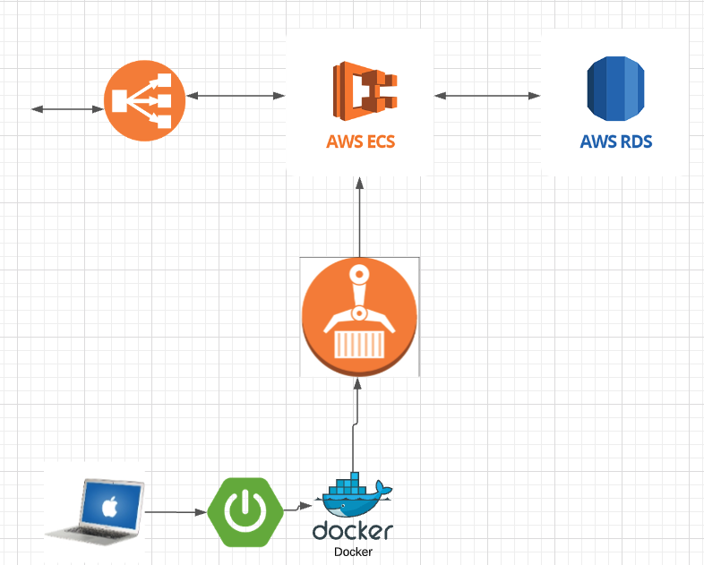
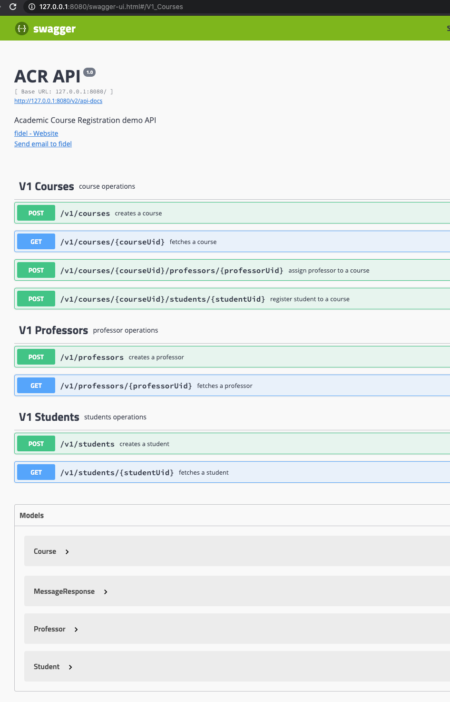

# ACR - Academic Course Registration demo

Sample spring boot service to model an Academic Course Registration system:

* swagger API documentation [as of 22-11-2020]: http://ec2co-ecsel-1mqis9lvmto3d-193356279.eu-west-1.elb.amazonaws.com/swagger-ui.html
* base url on AWS: `http://ec2co-ecsel-1mqis9lvmto3d-193356279.eu-west-1.elb.amazonaws.com/`
* base url when developing locally: `http://127.0.0.1:8080/`

Purpose is: 
* Illustrate use of springboot + kotlin for a simple REST API following the [12factor practices](https://12factor.net/)
* Have both unit and db integration tests with high coverage
* Show API documented with swagger annotations
* Load test using a parallel project [acr-loadtester](https://github.com/fnunezkanut/acr-loadtester)
* Deploy to AWS showing use of Docker, ECR, ECS and RDS as well as other aws plumbing





## Requirements
* JDK 1.8
* docker (needed for testcontainers db integration tests)
* gradle (gradle wrapper is included)

## Developing locally

### Building with gradle

```
cd ~/github/acr/
./gradlew cb
```
This cleans up project, builds it and runs jacoco coverage report

### Packaging up and running locally in docker

```
cd ~/github/acr/
./gradlew cb
docker build --no-cache -t acr:latest -f Dockerfile
docker run -d --rm -p 8080:8080 acr:latest
curl "http://localhost:8080/v1/version"
#docker ps -a
```

### Flyway and setting up a local development database

To install, run, setup, populate a local postgres12 db on OSX:
 
```
brew install postgresql@12
brew services start postgresql@12
brew services list
pssql postgres
CREATE ROLE acr LOGIN PASSWORD 'acr';
GRANT ALL ON ALL TABLES IN SCHEMA public TO acr;
\q
````

Now that we have postgres (Same version as RDS) running, lets flyway migrate
```
cd ~/github/acr/
./gradlew flywayMigrate -i -Pflyway.url="jdbc:postgresql://localhost:5432/postgres"
```

### Running "testcontainer" db repo integration test

In order to actually excercise the code which interacts with progress, an "integrationTest" module exists in this project.

When run it downloads a docker postgres testcontainer (same version as RDS in "production") and does a flyway migration on it, followed by unit tests excercising the db connection code against real db, its fairly fast especially on subsequent runs, docker is required.

```
cd ~/github/acr/
./gradlew clean build integrationTest
```

### Test Coverage

Tests are split into
* unit tests using mockk in `/src/test/kotlin/*`
* db integration tests using testcontainers in `/src/integrationTest/kotlin/*`

There is a gradle code coverage limiter task in `build.gradle` which runs on every build and outputs result like this, dropping below limit specified in gradle file causes build failyre

```
> Task :jacocoTestReport
Checking coverage results: ~/github/acr/build/jacoco/test/jacocoTestReport.xml
metrics: [branch:54.55, line:85.71]
Passed Code Coverage Checks
```

## Deployment to AWS

* A lot of this work was done manually for purposes of demo and in real world would need to be automated of course! *

TODO: automate using terraform or code formation or other similar devops automation tool

Steps taken:
* create ECR repo
* create RDS postgresql 12 instance
* create ECS "cluster", "service" and "task"
* tweak application loadbalancer to accept port 80

### Uploading container to ECR

TODO: automate using ci/cd pipeline

```
aws --profile *** ecr get-login-password --region eu-west-1 | docker login --username AWS --password-stdin ***.dkr.ecr.eu-west-1.amazonaws.com
cd ~/github/ac
docker build --no-cache -t acr:latest -f Dockerfile
docker tag acr:latest ***.dkr.ecr.eu-west-1.amazonaws.com/acr:latest
docker push ***.dkr.ecr.eu-west-1.amazonaws.com/acr:latest
```

### Setting up RDS

TODO: automate using terraform or code formation or other similar devops automation tool

Run flyway migration and setup initial tables (might need to open port in LB, this is insecure of course)
```
/gradlew flywayMigrate -i -Pflyway.url="jdbc:postgresql://***eu-west-1.rds.amazonaws.com:5432/postgres?user=***&password=***"
```

### ECS Cluster config

TODO: automate using terraform or code formation or other similar devops automation tool

create ECS "cluster", "service" and "task"
ensure JDBC_* env params are set and pointing at the RDS database so springboot container knows what to connect to

## Load Testing

See parallel project for load testing the rest api with gatling parallel project [acr-loadtester](https://github.com/fnunezkanut/acr-loadtester)

## PAW

Paw is a great API tool on mac, https://paw.cloud/ similar to Postman but better :)

Included is an `acr.paw` file used during development of this project